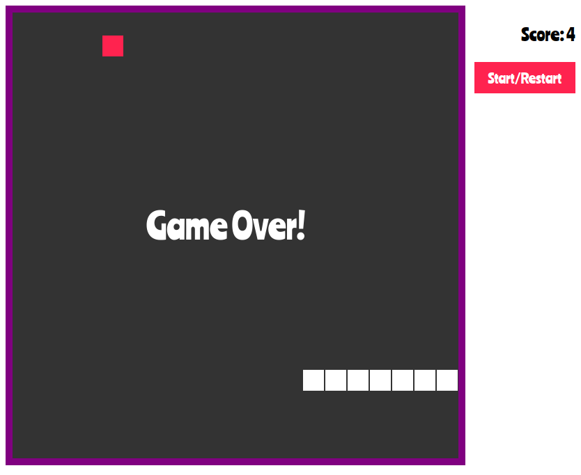

[![LinkedIn][linkedin-shield]](https://www.linkedin.com/in/minhajul/)

<!-- PROJECT LOGO -->
<p align="center">
  <h3 align="center">Snake 🐍</h3>
  <p align="center">
    Revisit your childhood by playing this snake game.
    <br />
    <br />
    <a href="https://snake-mk.netlify.app/">View Demo</a>
    ·
    <a href="https://github.com/minhajul-karim/webdevchallanges/issues">Report Bug</a>
    ·
    <a href="https://github.com/minhajul-karim/webdevchallanges/issues">Request Feature</a>
  </p>
</p>

<!-- ABOUT THE PROJECT -->

## About The Project

<p align="center">
  <a href="https://snake-mk.netlify.app/">
    
  </a>
</p>

### Built With

- Javascript
- HTML
- CSS

<!-- GETTING STARTED -->

## Getting Started

To get a local copy up and running follow these simple steps.

### Installation

1. Clone the repo
   ```sh
   git clone https://github.com/minhajul-karim/webdevchallanges.git
   ```
2. Go to the snake folder and open `index.html` file in your browser.

<!-- USAGE EXAMPLES -->

## Usage

Click the `Start/Restart` button to start or restart this game. Use `Right Arrow` `Up Arrow` and `Down Arrow` keys to move the snake to right, top, and bottom. Red-_ish_ objects are foods for the snake. If you eat food, the snake and the score will be incremented. Hitting any walls or the snake itself will finish the game.

<!-- CONTACT -->

## Contact

Minhajul Karim - [@minhajul93](https://twitter.com/minhajul93) - minhajul.kaarim@gmail.com

Project Link: [https://github.com/minhajul-karim/webdevchallanges/tree/main/snake](https://github.com/minhajul-karim/webdevchallanges/tree/main/snake)

<!-- ACKNOWLEDGEMENTS -->

## Acknowledgements

- [The Frontend Developer Career Path - Scrimba](https://scrimba.com/learn/frontend)
- [Ania Kubów](https://twitter.com/ania_kubow)
- [Best-README-Template
  ](https://github.com/othneildrew/Best-README-Template)

<!-- MARKDOWN LINKS & IMAGES -->
<!-- https://www.markdownguide.org/basic-syntax/#reference-style-links -->

[contributors-shield]: https://img.shields.io/github/contributors/minhajul-karim/repo.svg?style=for-the-badge
[contributors-url]: https://github.com/minhajul-karim/repo/graphs/contributors
[forks-shield]: https://img.shields.io/github/forks/minhajul-karim/repo.svg?style=for-the-badge
[forks-url]: https://github.com/minhajul-karim/repo/network/members
[stars-shield]: https://img.shields.io/github/stars/minhajul-karim/repo.svg?style=for-the-badge
[stars-url]: https://github.com/minhajul-karim/repo/stargazers
[issues-shield]: https://img.shields.io/github/issues/minhajul-karim/repo.svg?style=for-the-badge
[issues-url]: https://github.com/minhajul-karim/repo/issues
[license-shield]: https://img.shields.io/github/license/minhajul-karim/repo.svg?style=for-the-badge
[license-url]: https://github.com/minhajul-karim/repo/blob/master/LICENSE.txt
[linkedin-shield]: https://img.shields.io/badge/-LinkedIn-black.svg?style=for-the-badge&logo=linkedin&colorB=555
[linkedin-url]: https://linkedin.com/in/minhajul-karim
